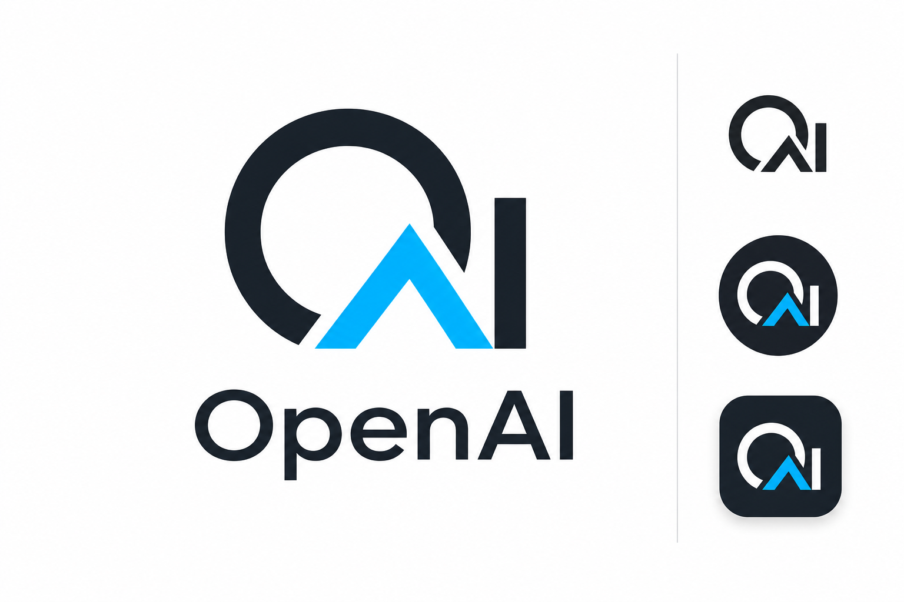
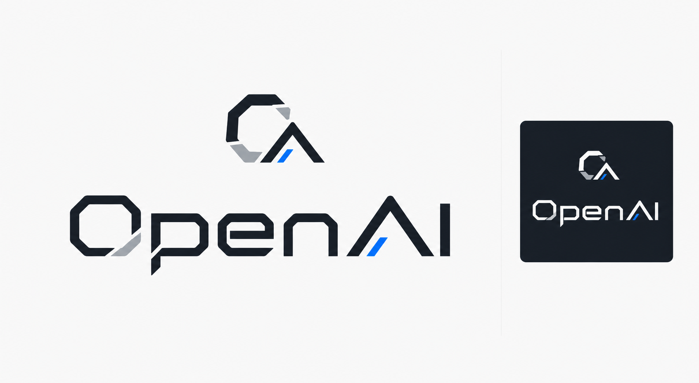
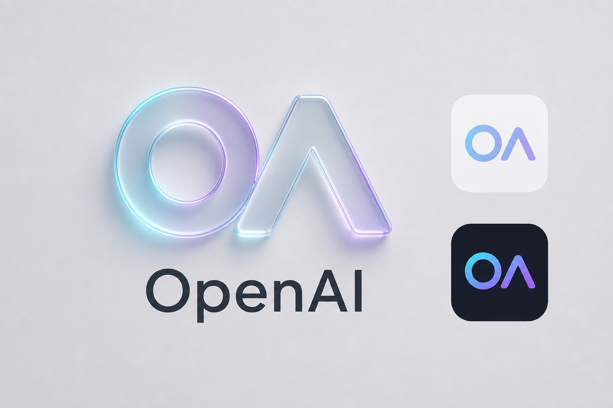

"#\"AIGC标志技能\""

一个用于生成 AIGC 平台多风格 Logo 的 Codex 技能。

##支持的 Logo 风格

1. 几何字母标志风
2. 流体渐变生成风
3. 智能节点网络风
4. 未来科技字标风
5. 轻 3D / 玻璃拟态风

##使用方式

在 Codex 中使用：

```text
使用 $logo-ai-iigc 生成五个我 AIGC 平台的 logo 风格方向。
文件结构
SKILL.md
参考文献/
assets/showcase/
代理/
说明
该 Skill 适合用于 AIGC、AI 平台、内容生成平台、智能创作工具等品牌的 Logo 方向探索。

保存时下面的 commit message 可以写：

```text
添加 README 描述
# AIGC Logo Skill

一个用于生成 AIGC 平台多风格 Logo 的 Codex Skill。

## 风格展示

| 风格 | 预览 |
| --- | --- |
| 几何字母标志风 |  |
| 流体渐变生成风 |  |
| 智能节点网络风 |  |
| 未来科技字标风 |  |
| 轻 3D / 玻璃拟态风 |  |
